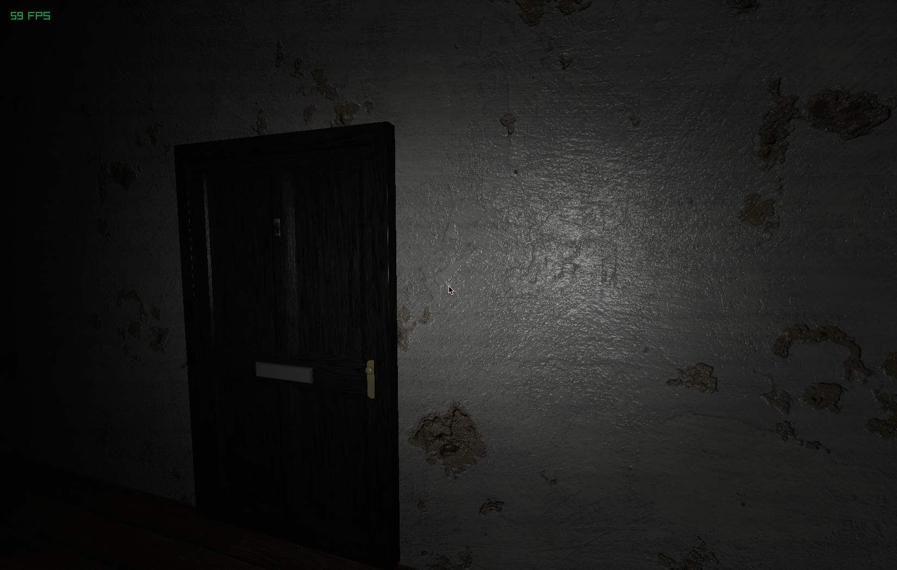

# ˚୨୧⋆ Peephole ｡˚ ⋆

### A speculative dystopia horror game designed around looking through a peephole.

  <table>
    <tr>
      <td>
        

          
        

      </td>
    </tr>
    <tr>
      <td>
        

          A sneak peek at the current state of the game
        

      </td>
    </tr>
  </table>

### ✩ _If you like this project, consider giving it a star!_ ✩

### ♡ **Why does this exist?**

I spontaneously decided I wanted to create a horror game, so I decided to create one using Elle and Raylib. This also acts as yet another interesting test of the language's capibilities.

### ♡ **How to build?**

`make` (or `make run` to also run the game)

### ♡ **Licensing**

- See the [LICENSE](https://github.com/acquitelol/simplex/blob/main/LICENSE)
- Copyright © 2026 Rosie ([acquitelol](https://github.com/acquitelol))

<a href="#top">⇡ Back to top️!</a>
